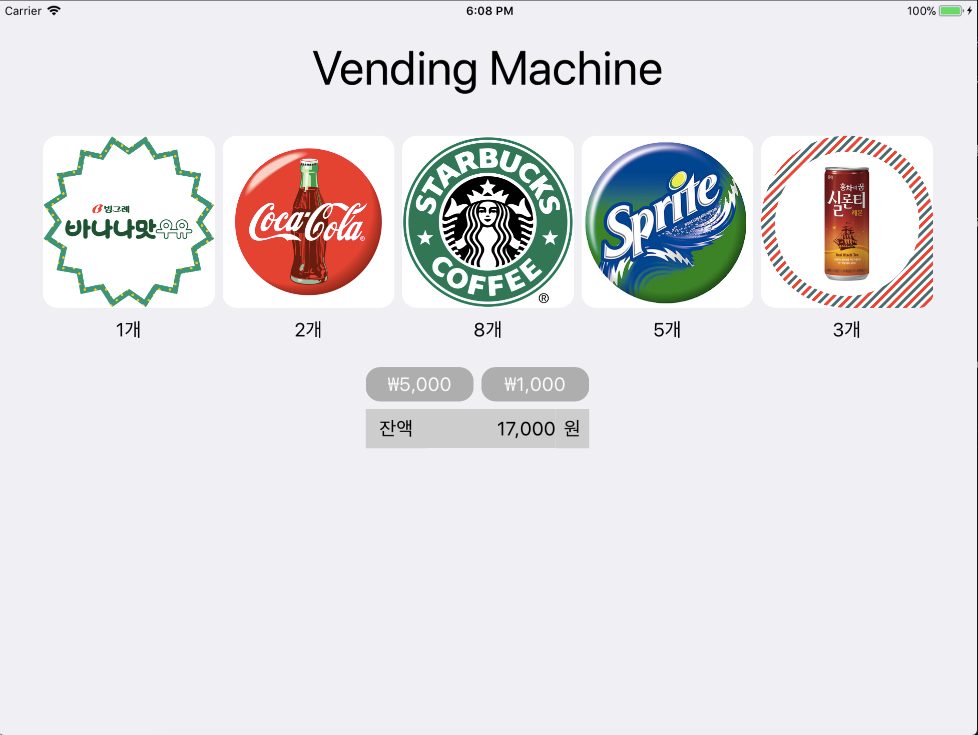
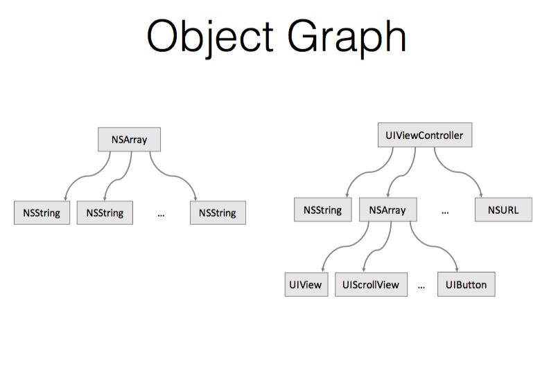

# 음료 자판기 앱 Step1
## 프로그래밍 요구사항
* 레벨2 VendingMachine 미션의 Main, InputView, OutputView를 제외하고 전체 클래스를 프로젝트로 복사한다.
> 복사할때 폴더보다는 옵션에서 **그룹**으로 해야 우리가 알고 있던 방식으로 폴더가 된다.

* 기존 코드들은 MVC 중에서 대부분 Model의 역할을 담당한다.

* iOS 앱 구조는 MVC 중에서도 우선 ViewController-Model 사이 관계에 집중하고, ViewController-View 관계는 다음 단계에서 개선한다.<br>


* ViewController 클래스에 VendingMachine 객체를 변수로 추가하고 viewDidLoad() 함수에서 음료수 객체 3종류를 추가하고 재고 목록을 print() 한다.
```
[StarBucksCoffee: 1, LightBananaMilk: 1, Coke: 2]
```
<<<<<<< HEAD

=======
>>>>>>> a0abdad426851b2e7f40ca96f726501c50518265
<br><br><br>
# MVC 패턴 Step2
## 프로그래밍 요구사항
* 각 상품의 재고 추가 버튼을 누르면 각 상품 재고를 추가하도록 코드를 구현한다.
* 재고 추가 버튼을 누르고 나면 전체 레이블을 다시 표시한다.
* 금액 입력 버튼을 누르면 해당 금액을 추가하도록 코드를 구현한다.
* 금액을 추가하고 나면 잔액 레이블을 다시 표시한다.<br>


<br><br><br>
# 앱 생명주기와 객체 저장 Step3
## 프로그래밍 요구사항

* VendingMachine 변수를 ViewController에서 포함하지 않고 AppDelegate로 옮긴다.<br>

AppDelegate에 선언한 변수를 ViewController에서 접근하기 위한 방법을 찾는다.
## AppDelegate에서 선언한 변수 다른 VC에서 사용하기
VC에서 AppDelegate에 선언된 변수를 사용하는 방법은 다음과 같다.<br>
UIApplication.delegate 객체가 AppDelegate의 인스터스이니까, 사용하고자하는 VC에서 변수를 선언하다. 
```swift
let appDelegate = UIApplication.shared.delegate as? 
```
UIApplication shared 클래스... 좀더 공부해봐야하는 대목. 현재 실행중인 어플리케이션의 추상화 인스턴스를 얻어올 수 있다.(shared)
프로젝트내에서 vendingMachine이라는 변수로 같은 이름으로 사용하고 싶을때 다음과 같이 사용한다.
```swift
extension ViewController {
    var vendingMachine: VendingMachineData {
        guard let appDelegate = UIApplication.shared.delegate as? AppDelegate else {
            return VendingMachineData()
        }
        return appDelegate.vendingMachine
    }
}
```
>힌트. UIApplication.delegate 객체가 AppDelegate의 인스터스임<br>

* 앱 종료(background) 시점 콜백 함수에서 VendingMachine 객체 인스턴스 속성을 저장한다.
    1. 저장할 때는 VendingMachine을 아카이브해서 하나의 데이터 값으로 변형한다.
    2. 값을 저장하고 복원하는 데에는 UserDefault 라는 파운데이션 라이브러리를 사용한다.
데이터를 저장하는 방법은 여러가지가 있다. 다음의 표와같이 사용하고자 하는 데이터에 따라 방식을 정하면된다.

| 데이터 타입 | 추천 방식 |
| :------------ | :-----------: |
| 사용자 설정    | NSUserDefaults          |
| 작은 파일, 크로스 플랫폼    | NSPropertyListSerialization     |
| 객체 참조 그래프<br>(non-property list types)    | NSKeyedArchiver  |
| 큰 데이터, 객체 참조 데이터베이스 | Core Data |
| 특정 형식의 데이터 | Custom Format |
[Persistence Cheat Sheet][]

* 앱 시작(activate) 시점 콜백 함수에서 기존에 저장된 값에서 불러와서 VendingMachine 객체 인스턴스를 생성한다.
    1. 복원할 때는 저장된 데이터 값을 언아카이브해서 VendingMachine 객체를 생성한다.


따라서 객체간의 참조 그래프를 가지고있는 vendingMachine은 NSKeyedArchiver를 사용해야한다. 아카이브 특징은 다음과 같다.
* 객체 그래프를 그대로 저장할 때 
* 하위/상위 호환성을 유지할 수 있다.
* 인코딩/디코딩 과정에서 대체 가능 
* 객체가 Plist 지원하도록 강제할 필요없음 
* **Coding 프로토콜을 구현해야 함!**

주의할점은 저장하고자하는 객체에 아카이브를 하면 그 객체에 사용되는 class와 struct모두 NSCoding 프로토콜을 채택해줘야한다.<br>
그리고 NSObject도 같이 채택해줘야한다.(왜그런지는 모르겠다....)<br>

```class VendingMachineData: NSObject, NSCoding```<br>
```class Beverage: NSObject, NSCoding, NSCopying```<br>

등등등.. 여기서 발생한 **문제**가 있다. 원래 Beverage class는 sortedStockList의 딕셔너리를 채우기위해 key값으로 클래스를 택했었다. ```[Beverage: Int]```
키값을 비교하고 Value를 변경하기 위해서는 ```Hashable```를 이용하여, 클래스안에 name과 비교하려는 클래스의 name의 hash값을 비교해야하는데, NSObject를 채택하는 순간
```Hashable```은 필요없는 프로토콜이되어버렸다. 그이유는 NSObject에서 이미 Hashable프로토콜을 채택하고 사용하기 때문이었다. 그래서 정상작동하던 코드가 정상작동을 하지 않게 되는 것이었다. 그 이유는 ```func ==()``` 메소드가 호출되지 않았던 것! NSObject는 ```ìsEqual(_ object: Any?) -> Bool```을 호출 하는 것이었다.
따라서 다음과 같이 코드를 변경해 주어야했다.<br>
```swift
    override var hashValue: Int {
        return name.hashValue
    }
    override func isEqual(_ object: Any?) -> Bool {
        guard let other = object as? Beverage else { return false }
        return self.name == other.name
    }
```
이제 NSCoding을 채택한 클래스는 다음의 코드처럼 아카이브할때 필요한 메소드와 언아카이브할때 필요한 메소드(정확히는 생성자)를 구현해주어야한다. <br>
```swift
    required init?(coder aDecoder: NSCoder) {
        super.init()
        guard let stock = aDecoder.decodeObject(forKey: "stock") as? [Beverage] else { return }
        self.stock = stock
        for item in stock {
            self.makeBeverageList(item)
        }
        self.balance = aDecoder.decodeInteger(forKey: "balance")
    }
    func encode(with aCoder: NSCoder) {
        aCoder.encode(self.stock, forKey: "stock")
        aCoder.encode(self.balance, forKey: "balance")
```
단 지저분해지는게, 사용되는 모든 클래스에 적용해줘야한다는 점이 조금 지저분해진다.

마지막으로, 아카이브된 객체를 저장하는 방법에대해 소개하겠다. 간단하게 UserDefaults.standard,set을 이용한다. 여기서 ```(value: Any?)```부분에 아카이브를 하는 코드를 넣어줘야한다.
```swift        
UserDefaults.standard.set(NSKeyedArchiver.archivedData(withRootObject: self.vendingMachine), forKey: "vendingMachine")
```
반대로 앱이 호출될때, 언아카이브하기위해 다음과 같이 해준다.
```swift
func application(_ application: UIApplication, didFinishLaunchingWithOptions launchOptions: [UIApplicationLaunchOptionsKey: Any]?) -> Bool {
        if UserDefaults.standard.object(forKey: "vendingMachine") != nil {
            let userDefaultMachine = UserDefaults.standard.object(forKey: "vendingMachine")
            guard let vendingMachineData = userDefaultMachine as? Data else { return false }
            guard let unarchiveVendingMachine = NSKeyedUnarchiver.unarchiveObject(with: vendingMachineData) else { return false }
            guard let vendingMachine = unarchiveVendingMachine as? VendingMachineData else { return false }
            self.vendingMachine = vendingMachine
        }
        return true
    }
```
```func application```에 언아카이브하는 코드를 넣어준 이유는, viewDidController에서 화면에 저장된값을 뿌리기위해 값을 먼저 불러오고 뷰를 불러야하기 때문이다.

# 싱글톤 Step4
## 프로그래밍 요구사항
* VendingMachine 객체를 싱글톤(Singleton)으로 접근할 수 있도록 개선한다.
* VendingMachine 싱글톤으로 sharedInstance 인터페이스를 통해서 AppDelegate와 ViewController에서 접근하도록 코드를 수정한다.

```swift
    static var sharedInstance: VendingMachineData = {
        return VendingMachineData()
    }()

    private convenience override init() {
        self.init(stock: [])
    }
    in
```
간단하게 위와같이 싱글톤 객체로 만들고 싶은 객체에서 선언한뒤 사용한다. 쓰레드safe한 싱글톤음.<br>

###Single tone
* 사용이유
    * 사용하는 클래스을 단하나의 객체로 보장하고 싶을때 사용.
    * 객체를 생성하면 Heap메모리에 올라가고 stack메모리에는 그 객체를 가리키는 변수가 생성된다. 계속 사용되는 객체일 경우 heap, stack메모리에 계속 생성 제거가 반복적으로 발생하기 때문에, 자주사용하거나 하나만 있으면 되는 객체라면 한번의 생성으로 메모리생성 시간낭비를 방지할 수 있다.

* 단점
    * 싱글톤은 전역변수처럼 여기저기서 사용할 수 있기 때문에, 시스템에 오류가 발생할 확률이 높다.
    * 단위테스트시 어려움이 있다. 싱글톤 객체의 생성과 소멸이 확실하지 않기 때문에, 생성과 소멸 함수를 따로 만들어주어 테스트시 사용해야한다.
    * 멀티쓰레드 환경에서 쓰레드 세이프하게 만들어줘야한다.<br>
    swift에서 static이 lazily initalized되어서 GCD에서 제공해주는 dispatch_once()로 싱글톤 객체를 만들어 쓰레드 세이프하게 안해도 된다.<br>

    > **Dispatch** from doc.<br>
The free function dispatch_once is no longer available in Swift. In Swift, you can use lazily initialized globals or static properties and get the same thread-safety and called-once guarantees as dispatch_once provided.


  <br><br><br>
# 관찰자 패턴 적용하기 Step5
## 프로그래밍 요구사항
* ViewController는 viewDidLoad에서 Observe를 등록한다.
* 음식 재고가 바뀌는 Notification을 받으면 화면에 Label을 업데이트한다.
* 추가 버튼을 누르면 해당 음식 재고를 모델에 추가할 때마다 VendingMachine 모델 객체에서는 전체 음식 재고를 NotificationCenter에 post한다.
* 모든 동작은 이전 단계와 동일하게 동작해야 한다.

#### 관찰자 패턴
> 객체 사이에 일 대 다의 의존 관계를 정의해두어, 어떤 객체의 상태가 변할 때 그 객체에 의존성을 가진 다른 객체들이 그 변화를 통지 받고 자동으로 업에이트될 수 있게 만듭니다. (GoF의 디자인 패턴 382p)

MVC패턴의 기반이되는것이 관찰자 패턴이다.
